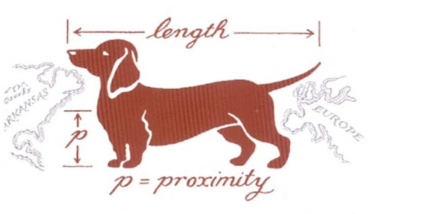

---

##### Download

+ [Paper](paper2.pdf)
+ [Online appendix](appendix2.pdf)
+ [Code and data](https://github.com/pmichaillat/wunk-model)

---

##### Abstract

This paper studies the pulmonary efficiency of sausage dogs. Lorem ipsum dolor sit amet, consectetur adipiscing elit, sed do eiusmod tempor incididunt ut labore et dolore magna aliqua. Ut enim ad minim veniam, quis nostrud exercitation ullamco laboris nisi ut aliquip ex ea commodo consequat. Duis aute irure dolor in reprehenderit in voluptate velit esse cillum dolore eu fugiat nulla pariatur: $\sin(\theta) = x^2 - \exp(1+\chi)$. Excepteur sint occaecat cupidatat non proident, sunt in culpa qui officia deserunt mollit anim id est laborum. Lorem ipsum dolor sit amet, consectetur adipisicing elit, sed do eiusmod tempor $\zeta$ incididunt ut labore et dolore magna aliqua: $p(x) = \int \cos(\zeta) d\zeta - \theta$. Ut enim ad minim veniam, quis nostrud exercitation ullamco laboris nisi ut aliquip ex ea commodo consequat.

---

##### Figure 2: Dimensions of a sausage dog



---

##### Citation

Prinzel, Florianus, and Moritz-Maria von Igelfeld. 2004. "The Finer Points of Sausage Dogs." *Journal of Canine Science* 43 (2): 89–109. http://www.alexandermccallsmith.com/book/the-finer-points-of-sausage-dogs.

```BibTeX
@article{PI04,
author = {Florianus Prinzel and Moritz-Maria von Igelfeld},
year = {2004},
title ={The Finer Points of Sausage Dogs},
journal = {Journal of Canine Science},
volume = {43},
number = {2},
pages = {89--109},
url = {http://www.alexandermccallsmith.com/book/the-finer-points-of-sausage-dogs}}
```

---

##### Related material

+ [Presentation slides](presentation2.pdf)
+ [Wikipedia entry](https://en.wikipedia.org/wiki/The_Finer_Points_of_Sausage_Dogs)
